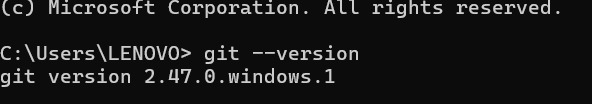
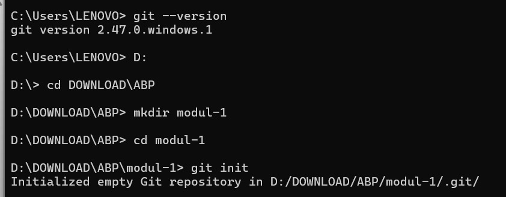
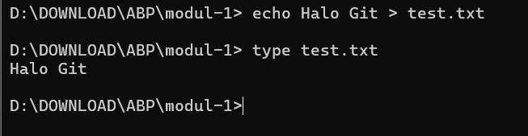
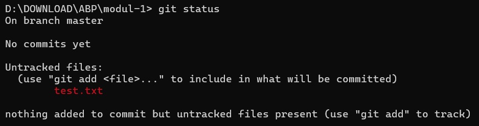
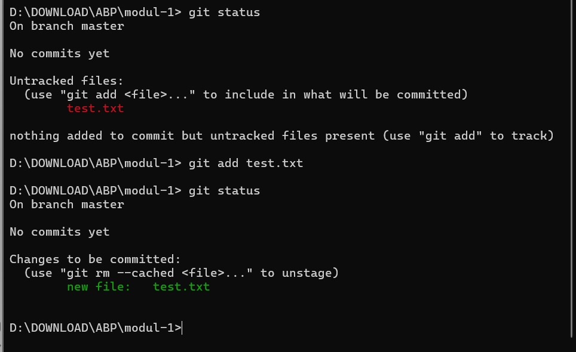
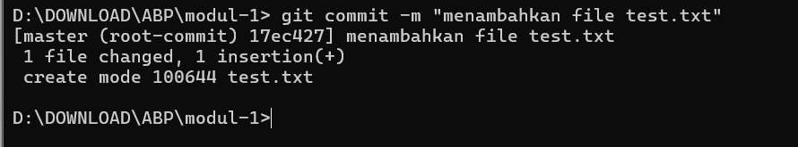
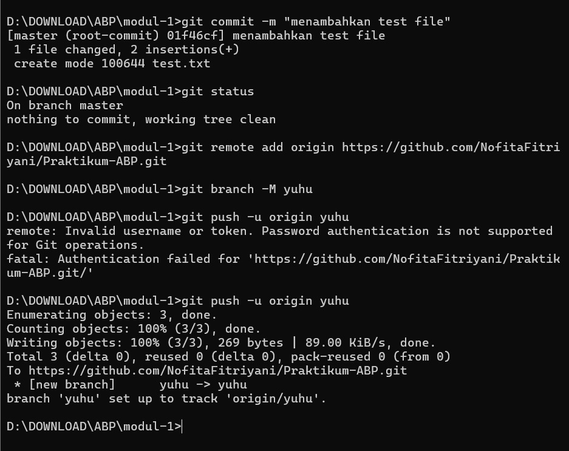
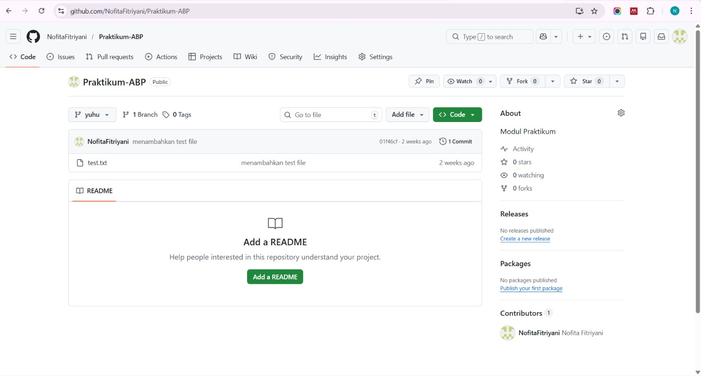

<h1 align="center">LAPORAN PRAKTIKUM</h1>
<h1 align="center">APLIKASI BERBASIS PLATFORM</h1>

 

<h2 align="center">MODUL 1</h2>
<h2 align="center">GIT</h2>

  

   

<h2 align="center">Disusun Oleh :</h2>

  <b>Nofita Fitriyani</b> 
  <b>2311102001</b> 
  <b>S1 IF-11-REG 01</b>

 
<h2 align="center">Dosen Pengampu :</h2>

  <b>Dimas Fanny Hebrasianto Permadi, S.ST., M.Kom</b>

 
<h2 align="center">Asisten Praktikum :</h2>

  <b>Apri Pandu Wicaksono</b> 
  <b>Rangga Pradarrell Fathi</b>

 
<h1 align="center">LABORATORIUM HIGH PERFORMANCE</h1>
<h1 align="center">FAKULTAS INFORMATIKA</h1>
<h1 align="center">UNIVERSITAS TELKOM PURWOKERTO</h1>
<h1 align="center">TAHUN 2026</h1>

## DASAR TEORI
Git adalah salah satu sistem pengontrol versi (Version Control System) pada proyek perangkat lunak yang
diciptakan oleh Linus Torvalds. Pengontrol versi bertugas mencatat setiap perubahan pada file proyek yang
dikerjakan oleh banyak orang maupun sendiri. Git dikenal juga dengan distributed revision control (VCS
terdistribusi), artinya penyimpanan database Git tidak hanya berada dalam satu tempat saja.
## LANGKAH-LANGKAH SET-UP REPOSITORY  VIA CLI
### 1. Mengecek Instalasi Git
Langkah pertama adalah memastikan Git sudah terinstall pada komputer dengan menjalankan perintah: git --version
Perintah tersebut akan menampilkan versi Git yang terpasang.

### 2. Membuat Repository Lokal
Repository baru dibuat menggunakan perintah berikut: mkdir modul-1
Perintah ini akan membuat folder repository baru bernama modul-1 serta membuat direktori `.git` di dalamnya.

### 3. Membuat File Baru
File baru dibuat menggunakan perintah: echo Halo git > test.txt
Kemudian menambahkan isi file: echo "Halo Git" >> test.txt
Untuk melihat isi file digunakan perintah: type test.txt

### 4. Mengecek Status Repository
Untuk melihat perubahan pada repository digunakan perintah: git status
Perintah ini menampilkan file yang belum dimasukkan ke dalam repository (untracked file).

### 5. Menambahkan File ke Staging Area
File ditambahkan ke staging area menggunakan perintah: git add test.txt
Perintah ini menandakan bahwa file siap untuk disimpan ke repository.

### 6. Melakukan Commit
Setelah file berada di staging area, perubahan disimpan menggunakan perintah: git commit -m "menambahkan file test.txt"
Perintah commit akan menyimpan perubahan yang telah dilakukan.

### 7. Menghubungkan folder lokal ke Repository Github
Setelah melakukan commit pada repository lokal, langkah selanjutnya adalah menghubungkan repository tersebut dengan repository yang ada di GitHub.
Repository GitHub digunakan sebagai remote repository untuk menyimpan project secara online sehingga dapat diakses dan dikelola melalui GitHub.
Perintah yang digunakan untuk menambahkan remote repository adalah sebagaimana yang tertera dalam gambar

### 8. Repository Github Berhasil Diperbarui

## Kesimpulan
Berdasarkan praktikum yang telah dilakukan, dapat disimpulkan bahwa Git merupakan sistem version control yang digunakan untuk mengelola perubahan pada project. Dengan Git, pengguna dapat membuat repository, menambahkan file, memantau perubahan, serta menyimpan perubahan tersebut menggunakan commit.
