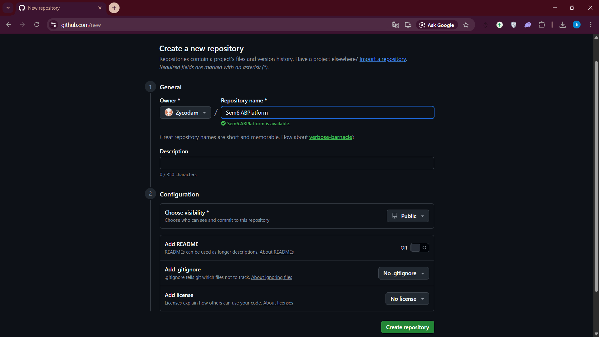
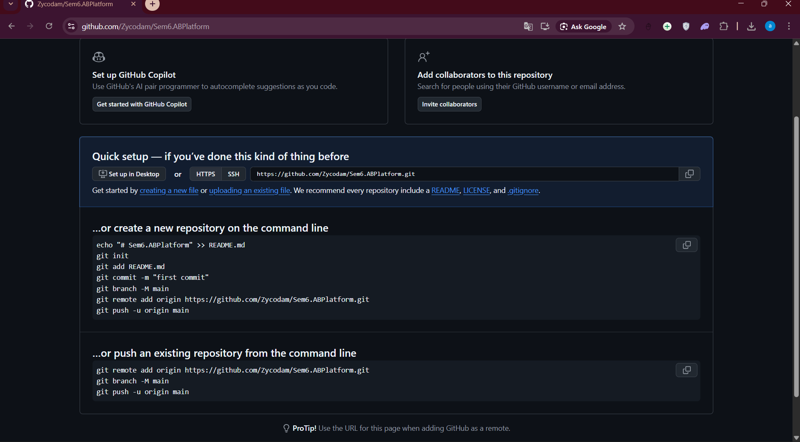
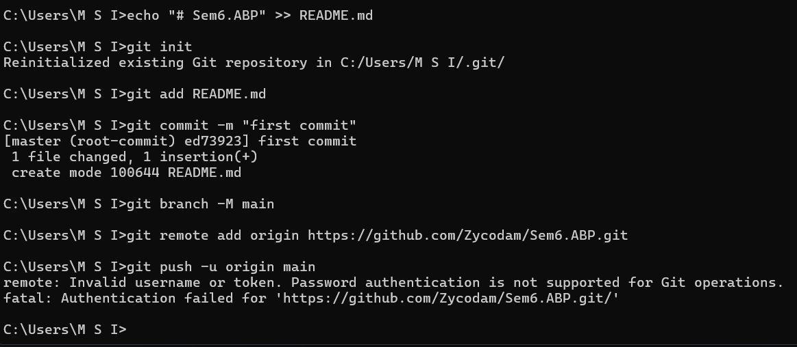
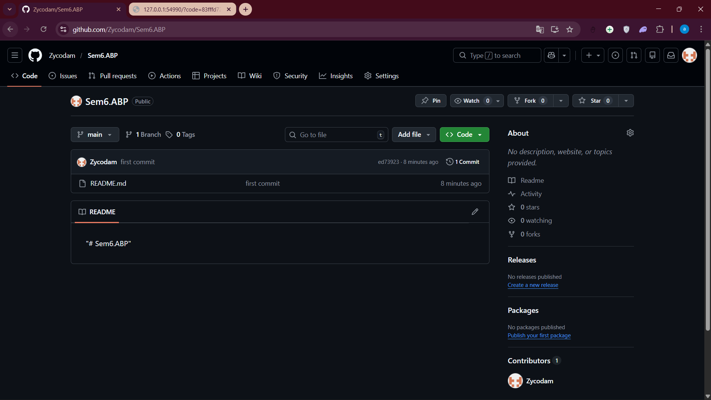

 

# LAPORAN PRAKTIKUM  
# APLIKASI BERBASIS PLATFORM

 

## MODUL 1  
## GIT

 

  

### Disusun Oleh

**Syamsul Adam**  
**2311102144**  
**S1 IF-11-REG01**

 

### Dosen Pengampu

**Dimas Fanny Hebrasianto Permadi, S.ST., M.Kom**

 

### Asisten Praktikum

**Apri Pandu Wicaksono**  
**Rangga Pradarrell Fathi**

  

### LABORATORIUM HIGH PERFORMANCE  
### FAKULTAS INFORMATIKA  
### UNIVERSITAS TELKOM PURWOKERTO  
### 2026

---

# 1. Dasar Teori

Git adalah sebuah sistem pengontrol versi (**Version Control System**) ciptaan **Linus Torvalds** yang sangat umum digunakan dalam rekayasa perangkat lunak. Fungsi utamanya adalah untuk melacak dan merekam segala modifikasi pada dokumen atau kode proyek, baik untuk pengerjaan secara mandiri maupun kolaborasi tim.

Git juga termasuk dalam kategori **Distributed Version Control System** (sistem kontrol versi terdistribusi). Artinya, basis data penyimpanan riwayat versi tidak hanya terpusat di satu server utama, melainkan salinannya terdistribusi secara lengkap di perangkat masing-masing pengembang.

---

# 2. Setup Repository via CLI

Di bawah ini langkah-langkah untuk konfigurasi repositori baru agar terhubung ke GitHub dengan menggunakan **Command Line Interface (CLI)**.

---

## Langkah 1: Pembuatan Repositori Baru di GitHub

Membuat sebuah repositori baru melalui platform **GitHub**.

---

## Langkah 2: Panduan Perintah Dasar Git

Perintah ini menjadi instruksi untuk menautkan folder proyek di memori lokal komputer Anda dengan repositori *online* di GitHub.

---

## Langkah 3: Eksekusi Perintah Git (Proses Push ke GitHub)

Jalankan instruksi Git secara berurutan:
- `git init` (Inisialisasi)
- `git add .` (Menambah file ke staging)
- `git commit -m "first commit"` (Menyimpan perubahan)
- `git remote add origin [URL_REPO_ANDA]` (Menghubungkan ke cloud)
- `git push -u origin main` (Mengunggah)

---

## Langkah 4: Pembaruan Repositori Berhasil

Jika berhasil, seluruh file Anda akan muncul di halaman repositori GitHub.

