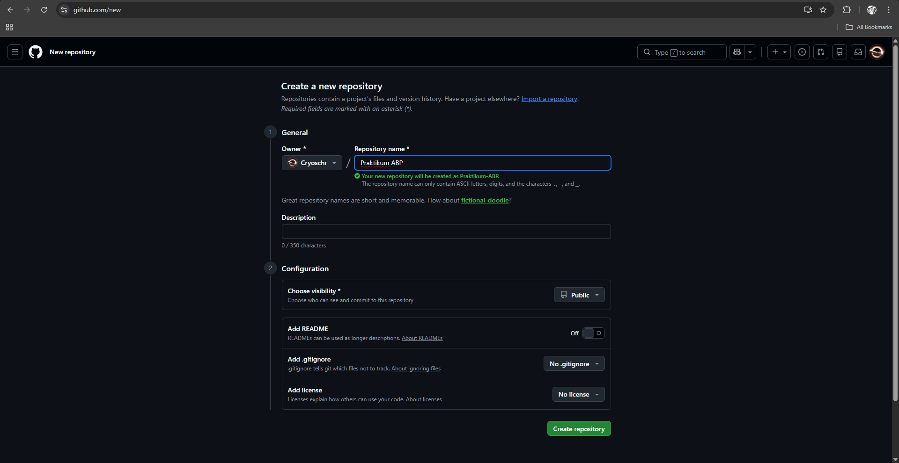
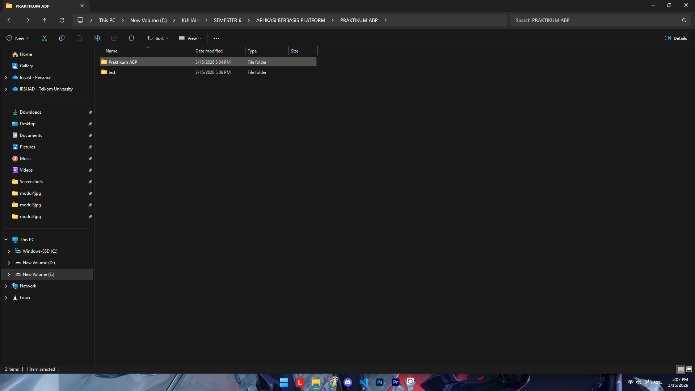
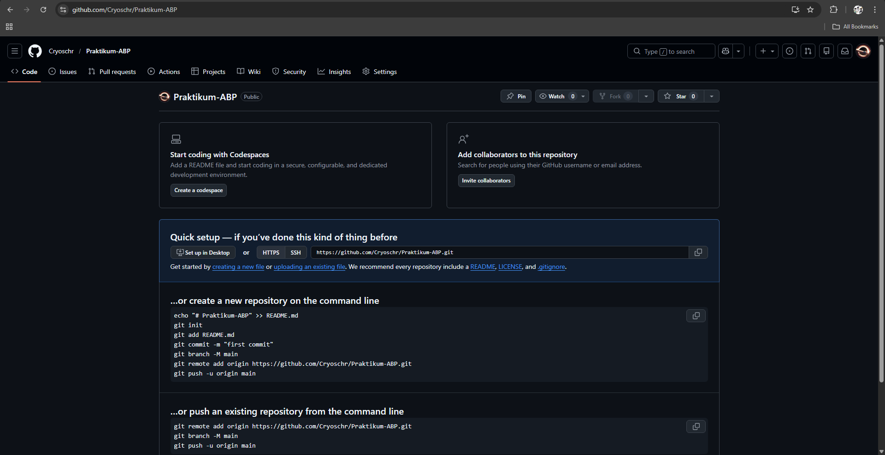
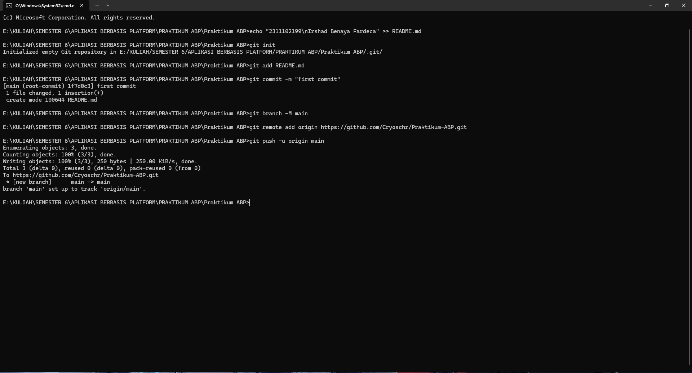
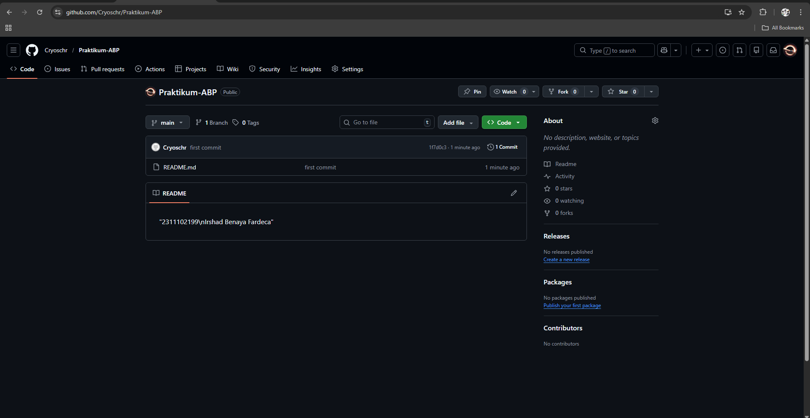

<div align="center">
  <br>

  <h1>LAPORAN PRAKTIKUM <br>
  APLIKASI BERBASIS PLATFORM
  </h1>

  <br>

  <h3>MODUL 1 <br>
  GIT
  </h3>

  <br>

  


  <br>
  <br>
  <br>

  <h3>Disusun Oleh :</h3>

  <p>
    <strong>Irshad Benaya Fardeca</strong><br>
    <strong>2311102199</strong><br>
    <strong>S1 IF-11-REG01</strong>
  </p>

  <br>

  <h3>Dosen Pengampu :</h3>

  <p>
    <strong>Dimas Fanny Hebrasianto Permadi, S.ST., M.Kom</strong>
  </p>
  
  <br>
  <br>
    <h4>Asisten Praktikum :</h4>
    <strong>Apri Pandu Wicaksono </strong> <br>
    <strong>Rangga Pradarrell Fathi</strong>
  <br>

  <h3>LABORATORIUM HIGH PERFORMANCE
 <br>FAKULTAS INFORMATIKA <br>UNIVERSITAS TELKOM PURWOKERTO <br>2026</h3>
</div>
<hr>

# Dasar Teori
## 2.1 Pengenalan Git
Git adalah salah satu sistem pengontrol versi (Version Control System) pada proyek perangkat lunak yang diciptakan oleh Linus Torvalds. Pengontrol versi bertugas mencatat setiap perubahan pada file proyek yang dikerjakan oleh banyak orang maupun sendiri. Git dikenal juga dengan distributed revision control (VCS terdistribusi), artinya penyimpanan database Git tidak hanya berada dalam satu tempat saja.

## 2.2 Instalasi GIT
Untuk melakukan instalasi git pada computer Anda, lakukan langkah berikut ini:
1. Buka link berikut ini untuk mengunduh Git. https://git-scm.com/download/win
2. Install GIT yang sudah di unduh
3. Pastikan Git sudah terinstall dengan melakukan perintah git --version pada command prompt
4. Lakukan konfigurasi awal dengan melakukan perintah

## 2.3 Penggunaan GIT
### 2.3.1 Membuat repository baru
Untuk membuat repositaru baru, gunakan perintah dibawah ini:
```
git init <nama repository>
```
Perintah git init akan membuat sebuah direktori bernama .git di dalam proyek yang akan dikerjakan. Direktori ini digunakan Git sebagai database untuk menyimpan perubahan yang kita lakukan.

### 2.3.2 Menambahkan isi repositori
Untuk menambahkan suatu file ke dalam repositori, kita langsung dapat menambahkan file yang kita inginkan ke dalam folder projek yang telah kita buat. touch <nama file> adalah perintah untuk membuat satu file baru yaitu <nama file>, echo “Halo Git” >> <nama file> adalah perintah untuk mengisi file <nama file> dengan “Halo Git”, lalu gunakan perintah cat <nama file> untuk melihat apa isi yang ada pada file <nama file>.
Dengan mengeksekusi perintah git status kita dapat melihat file yang berubah yang ada pada project kita. Namun harus diingat bahwa untracked files menandakan bahwa file tersebut belum disimpan dalam catatan repository kita, untuk menyimpannya, kita bisa menggunakan perintah git add <nama file>. Dapat kita lihat bahwa sekarang file <nama file> siap untuk disimpan, namun data belum benar-benar tersimpan sampai kita melakukan perintah git commit -m “pesan commit”. Setelah perintah git commit, maka git akan menyimpan semua perubahan yang ada, dan dengan menggunakan perintah git status, maka akan memperlihatkan status.


# Tugas
## 1. Melakukan setup repository via CLI
## Langkah Langkah
1. Buat repository baru di github

2. Siapkan folder lokal

3. Buka CMD dalam folder tersebut
4. Eksekusi perintah GIt

5. Membuat file README
```
echo "2311102199\nIrshad Benaya Fardeca" >> README.md
```
6. Inisialisasi Git
```
git init
```
7. Menambahkan file ke Staging Area
```
git add README.md
```
8. Melakukan Commit pertama
```
git commit -m "first commit"
```
9. Mengatur Branch Utama
```
git branch -M main
```
10. Menghubungkan ke GitHub
```
git remote add origin https://github.com/Cryoschr/Praktikum-ABP.git
```
11. Push ke GitHub
```
git push -u origin main
```
### Hasil Akhirnya

Git command dijalankan via CLI

Repository berhasil dibuat dan terhubung dengan folder lokal